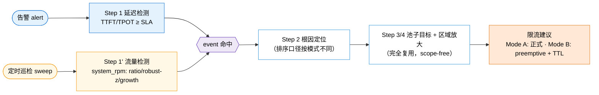
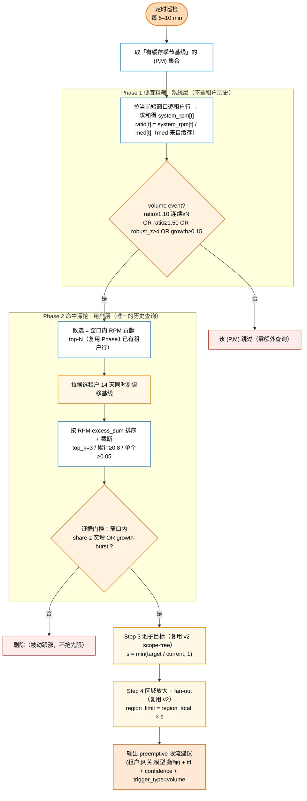
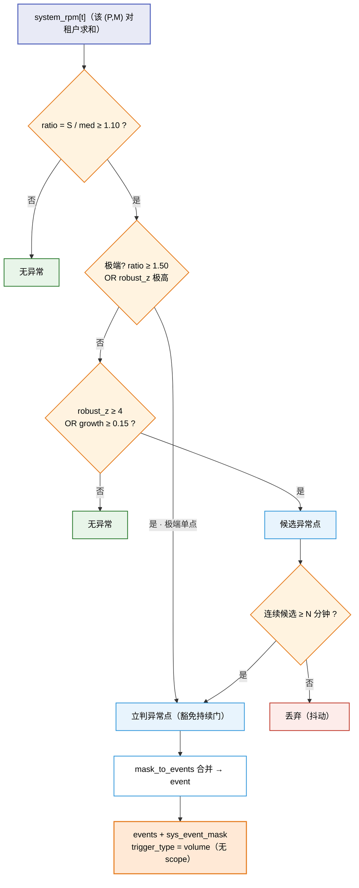
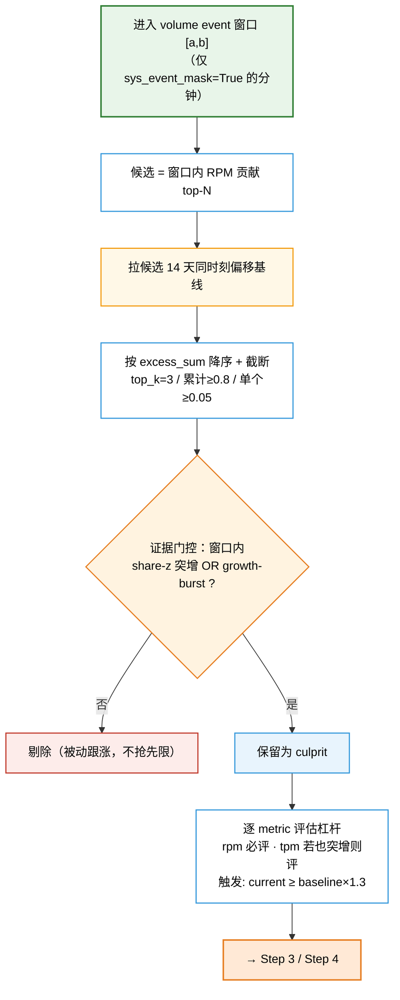

# 主动巡检算法设计（MaaS 流量前哨 · Mode B）

本文是一份**独立**的算法设计文档，描述在 [REGION_RATE_LIMIT_ALGORITHM.md](REGION_RATE_LIMIT_ALGORITHM.md)（v2，告警驱动）之上新增的「**主动巡检**」能力。术语、Step 2/3/4 全部沿用 v2，本文只新增**入口 + 检测信号 + 调度 + 输出元数据**。

> 与 v2 的关系：v2 是「**告警驱动 + 延迟触发**」——等到 TTFT/TPOT 击穿 SLA 的告警来了才动作。本文是「**自驱动 + 流量触发**」——定时巡检系统总量，在延迟被击穿**之前**就发现流量突增并抢先限流。二者是**并行的两个入口**，在 Step 2 之后**收敛到同一条根因→限流链路**。
>
> 参考来源：本文的「系统事件窗口 → 用户严格根因打标」两层结构借鉴了内部 AI QoS 方案的异常检测设计，并对齐到本仓库的 `(P,M)` 检测单元、分钟粒度与 region 限流执行层。它恰好对应 [ANOMALY_DETECTION_LOGIC.md](ANOMALY_DETECTION_LOGIC.md) §10 中被标为「当前未使用的旧逻辑」（ratio 门 / robust-z / growth burst / share-z / abs-z）的**重新启用**，但定位为**主动巡检层**，而非替换现有延迟检测。

---

## 0. 定位：两个入口模式（Mode A / Mode B）

| 维度 | **Mode A 反应式（现有 v2）** | **Mode B 主动巡检（本文）** |
| --- | --- | --- |
| 入口 | 一条告警 `(domain_id, P, M, time)` | 定时巡检遍历一批 `(P, M)` |
| 触发量 | system **TTFT/TPOT** | system **总量 RPM**（可选 TPM） |
| 判据 | `metric ≥ SLA` | `S` 相对季节基线突增（ratio / robust-z / growth） |
| 事件语义 | **已经慢了** | 流量在涨，**可能还没慢**（leading indicator） |
| 事件 scope | `ttft_only / tpot_only / both` | **无 scope**（`trigger_type = volume`） |
| 根因排序口径 | `max(ttft/sla, tpot/sla)` | **RPM excess** + 证据门控 |
| 限流性质 | 正式限流 | **抢先（preemptive）限流 + TTL**，可被告警升级确认 |

**核心洞察**：一个「volume event（流量突增窗口）」可以在延迟仍然健康时就存在。因此它**不能**交给 v2 的延迟版 Step 1（会被判 `normal`），主动巡检必须有自己的事件定义，但产出与告警路径**同构**，复用下游全部限流逻辑。



---

## 1. 设计目标

1. **提前**：在 SLA 被击穿之前，靠流量总量突增这一 leading indicator 主动发现潜在过载。
2. **自驱动**：不依赖告警，定时巡检一批 `(P, M)`，自己定义事件、自己定位根因。
3. **低成本**：巡检覆盖面大，必须把 API 成本与「命中数」而非「全量 `(P,M)` 数」挂钩。
4. **同构产出 + 可回退**：产出与 v2 同构的 `(租户, 网关, 模型, 指标)` 限流建议，但标记为**抢先**并带 TTL；系统若扛住则自愈，若真的恶化则被告警升级为正式限流。

---

## 2. 总览流程图（Mode B 端到端）



> 颜色：橙=入口/出口，蓝=处理，**米黄=历史查询 / 区域放大（成本与命中数挂钩）**，红=终止/无动作。

---

## 3. 术语与数据底座（复用 v2）

- **检测单元** = `(池子 P, 模型 M)`，同 v2。
- **系统序列** `S[t] = system_rpm[t] = Σ_tenant rpm`，分钟粒度，即 v2 [`_build_system_series`](plugin/main.py:480) 已经产出的 `system_rpm`。
- **季节基线** `med[t]`：复用 v2 的「14 天同时刻 ±10min 偏移基线」（[`_historical_baselines_by_offset`](plugin/main.py:753)），但在**系统级**（对租户求和后）按「分钟-of-day 偏移」聚合，并**缓存**（见 §7）。
- 拓扑映射（`endpoint_id ↔ gateway`、`gateway → region`、`model → SLA`）同 v2 §2.2，仅 Step 4 用到。

> 关键点：主动巡检**不引入新的数据维度或新接口**，只是把 v2 已有的 `system_rpm` 序列与偏移基线，从「告警时临时计算」改为「定时巡检 + 缓存」，并换上流量判据。

---

## 4. Step 1' — 流量事件检测（系统层）

在 `(P,M)` 的 `S[t] = system_rpm[t]` 上生成异常点 `sys_anom[t]`，再合并成 `events` + `sys_event_mask`。**无 latency scope**。

### 4.1 主门控：ratio 门（过滤日周期正常爬坡）

```text
med[t]   = 缓存的同分钟-of-day 偏移基线（系统级）
ratio[t] = S[t] / max(med[t], eps)
sys_ratio_anom[t] = ratio[t] >= sys_ratio_threshold     # 默认 1.10
```

含义：要求系统总量相对「同时刻历史」至少上升 10%，避免把正常日内爬坡当异常。

### 4.2 两个确认信号：robust-z 或 growth（二选一）

```text
# robust-z：用缓存的同时刻 median / MAD（无需重拉历史）
robust_z[t]  = (S[t] - med_median[t]) / (1.4826 * max(mad[t], eps))
sys_level_anom[t] = robust_z[t] >= sys_robust_z          # 默认 4.0

# growth：系统增长率（来自当前短窗口）
growth[t]    = S[t] / (S[t-1] + 1) - 1
sys_burst[t] = growth[t] >= sys_growth_rate_threshold    # 默认 0.15

sys_anom_normal[t] = sys_ratio_anom[t] AND (sys_level_anom[t] OR sys_burst[t])
```

### 4.3 单点极端旁路（不漏尖峰）

```text
sys_anom_extreme[t] = ratio[t] >= sys_extreme_ratio      # 默认 1.50（或 robust_z 极高）
```

### 4.4 持续门 + 事件合并（分钟级抗抖）

分钟级流量比小时级更抖，因此**沿用 v2 延迟路径的双轨**（[`_detect_system_events`](plugin/main.py:581) 的 `heavy | mark_runs(mild, N)`）：

```text
# 普通候选必须连续 N 分钟；极端单点豁免持续门
sys_anom[t] = mark_runs(sys_anom_normal, N) OR sys_anom_extreme[t]       # N 默认 10
events      = mask_to_events(sys_anom, merge_gap)
events      = cap_by_peak_ratio(events, max_events)      # 极端单点事件始终保留
sys_event_mask = union(events);  每个 event 标 trigger_type = "volume"
```

系统层流程图：



---

## 5. Step 2' — 根因定位（用户层：excess 排序 + 证据门控）

只在 `sys_event_mask` 为真的分钟内评估用户（严格模式，抑制误报）。

### 5.1 候选选择（RPM 口径，替换 v2 的延迟排序）

v2 的 [`_pick_candidates`](plugin/main.py:804) 按 `max(ttft/sla, tpot/sla)` 排序——但 volume 事件可能没有延迟信号，因此改为**按事件窗口内 RPM 贡献排序**取 Top-N（`candidate_top_n` 默认 6）。候选行直接复用 Phase 1 已经拉到的逐租户短窗口数据，**不产生额外查询**。

### 5.2 culprit 截断（excess 排序，同 v2 截断规则）

仅对候选拉取 14 天偏移基线（§7 Phase 2），计算窗口内超额并排序：

```text
excess[user,t] = max(rpm[user,t] - baseline_rpm[user,t], 0)
excess_sum[user] = Σ_{t∈[a,b]} excess[user,t]
按 excess_sum 降序，截断：top_k=3 / 累计占比≥0.8 / 除头名外单个≥0.05
```

### 5.3 证据门控（share-z 或 growth-burst，抑制被动跟涨）

被排序选中只说明「量大」，还须有「主动突增」的证据才保留为 culprit（否则可能是系统过载后被动跟涨的正常大户）：

```text
# 份额异常 share-z
P[user,t] = rpm[user,t] / max(S[t], 1)
zP        = z(P, past-only rolling mean/std)         # shift(1) 后 rolling
share_anom    = zP > share_z            # 默认 3.0
share_extreme = zP > share_z_extreme    # 默认 5.0

# 用户增长爆发 growth-burst
g[user,t]    = rpm[user,t] / (rpm[user,t-1] + 1) - 1
growth_flag  = g >= growth_rate_threshold            # 默认 0.8
growth_burst = 过去 growth_window 分钟内 growth_flag 命中 ≥ growth_min_hits   # 窗口 3min / 命中 1

keep_as_culprit = share_anom OR growth_burst
```

> 与参考设计的对齐：这等价于参考的 `flags_overload = (share_anom AND (growth_burst OR share_extreme)) OR abs_z_extreme` 的精简版——本文把「绝对量」证据交给 §5.2 的 excess 排序承担，门控层只保留 share / growth 两类「主动突增」证据，避免重复。完整 `abs-z` / `episode 回填` / `reason` 标签属于解释性输出，列为可选（§12）。

用户层流程图：



---

## 6. Step 3 / Step 4 — 完全复用 v2

对每个 culprit `(T, M)`，**原样套用** v2 §5 / §6：

- **Step 3 池子目标（scope-free）**：volume 事件天然点亮 **RPM 杠杆**（`current_rpm ≥ baseline_rpm × 1.3` → `target = baseline_rpm × 0.8`）；若 TPM 也突增则独立点亮 TPM 杠杆。`s_metric = min(target/current, 1)`，仅 `s<1` 才产出。
- **Step 4 区域放大 + fan-out**：`region_limit[g] = region_total[g] × s`，对池子 P 路由到的每个网关施加同一个 `s`。正确性论证、退化情形、collateral 同 v2 §6.1–§6.3。

> 因为 Step 3 在 v2 里本就是「统一、scope-free」，仅用 RPM/TPM 杠杆 + 偏移基线，所以无 scope 的 volume 事件可以**无缝**进入，不需要任何改动。

---

## 7. 调度与成本（两阶段巡检）

主动巡检的覆盖面远大于单条告警，成本结构是设计关键。把 v2 的 Round1/Round2 改造为「**缓存系统基线 + 命中再拉租户基线**」：

| 阶段 | 频率 | 查询 | 说明 |
| --- | --- | --- | --- |
| **基线刷新** | 每天 1 次 | 每个 `(P,M)` 拉 14 天系统级历史 | 预计算并缓存同时刻偏移 `{median, MAD, count}`，供 ratio 门 + robust-z 使用 |
| **Phase 1 粗筛** | 每 5–10 min | 每个 `(P,M)` 拉 1 次短窗口逐租户行 | 求和得 `system_rpm`，对缓存基线算 ratio / robust-z / growth；**未命中即止，零历史查询** |
| **Phase 2 深挖** | 仅命中时 | 仅候选租户拉 1 次 14 天偏移基线 | 即 v2 的 Round 2，只为命中 `(P,M)` 的 Top-N 候选 |

**成本结论**：每轮的历史查询量 ≈ `命中 (P,M) 数 × 1`，而非 `全量 (P,M) 数 × 14 天`。Phase 1 只做短窗口聚合查询，便宜且可并发。robust-z 因为吃缓存的 median/MAD，也无需在巡检时重拉历史。

> 巡检范围 = 「有缓存季节基线」的 `(P,M)` 集合。新 `(P,M)` 在攒够 `min_baseline_points` 历史前不参与巡检（等价于参考设计的 warm-up）。

---

## 8. 抢先限流生命周期（TTL + 升级确认）

抢先限流基于「还没真痛」的流量信号，必须可自愈，避免「系统其实扛住了」的长期误限。**算法侧只产元数据，执行/撤销由 MaaS-manager 据此决策**：

```text
每条 preemptive remediation 附带：
  preemptive   = true
  ttl_minutes  = 45              # 到期未被确认则自动撤销
  confidence   ∈ [0,1]           # 由事件强度映射，供 MaaS-manager 排序/取舍
```

- **自愈**：TTL 到期且期间未出现同 `(T, 网关, M)` 的延迟告警 → 自动撤销。
- **升级确认**：TTL 内若同 `(T, 网关, M)` 真的触发 Mode A 延迟告警 → 升级为正式限流并刷新（去掉 TTL）。
- **合并**：同 `(租户, 网关, 模型, 指标)` 的多条建议（跨 `(P,M)` 或跨模式）取并/取最严，沿用 v2 §10 交 MaaS-manager。

---

## 9. 输出契约（在 v2 §7 基础上的增量）

顶层沿用 v2：`status ∈ {anomaly, normal, no_data, error}`；主动巡检额外加：

```jsonc
{
  "status": "anomaly",
  "mode": "proactive",                       // 新增：区分 Mode A/B
  "detection": {                             // 新增：本次 (P,M) 的巡检证据
    "endpoint_id": "P", "model_name": "M",
    "trigger_type": "volume",                // 无 latency scope
    "peak_ratio": 1.7, "robust_z": 6.2, "growth": 0.31,
    "system_peak_rpm": 1700, "system_peak_rpm_time": "…"
  },
  "event": { "start": "…", "end": "…", "duration_minutes": 12 },   // 无 scope 字段
  "culprits": [
    {
      "domain_id": "T", "model_name": "M", "endpoint_id": "P",
      "evidence": { "share_z": 4.1, "growth_burst": true },        // 新增：门控证据
      "excess_sum_rpm": 0.0, "excess_ratio": 0.0,
      "peak_time": "…", "peak_rpm": 0,
      "remediations": [
        {
          "gateway_id": "…", "region": "贵阳", "target_metric": "rpm",
          "pool":   { "endpoint_id": "P", "current": 100, "target": 50, "baseline": 62.5, "s": 0.5 },
          "region": { "current_total": 1000, "recommended_limit": 500, "factor": 0.8 },
          "fanout_gateways": ["贵阳","香港"],
          "preemptive": true, "ttl_minutes": 45, "confidence": 0.78    // 新增
        }
      ]
    }
  ]
}
```

---

## 10. 参数表（粗体为本文新增 / 重定义）

| 参数 | 默认 | 阶段 | 说明 |
| --- | ---: | --- | --- |
| **`sys_ratio_threshold`** | 1.10 | 巡检检测 | ratio 门 |
| **`sys_extreme_ratio`** | 1.50 | 巡检检测 | 单点极端旁路 |
| **`sys_robust_z`** | 4.0 | 巡检检测 | robust-z 确认阈 |
| **`sys_growth_rate_threshold`** | 0.15 | 巡检检测 | 系统增长确认阈 |
| `mild_consecutive_windows` (N) | 10 | 巡检检测 | 持续门（分钟），复用 v2 |
| **`share_z` / `share_z_extreme`** | 3.0 / 5.0 | 巡检根因 | 份额异常门控 |
| **`growth_rate_threshold`** | 0.8 | 巡检根因 | 用户增长门控 |
| **`growth_window` / `growth_min_hits`** | 3min / 1 | 巡检根因 | growth-burst |
| `candidate_top_n` | 6 | 巡检根因 | 候选数（复用 v2） |
| `culprit_top_k / cum_ratio / min_ratio` | 3 / 0.8 / 0.05 | 巡检根因 | 截断（复用 v2） |
| `history_days / same_time_minutes / min_baseline_points` | 14 / 10 / 6 | 基线 | 同时刻偏移基线（复用 v2） |
| `scenario_trigger_factor` | 1.3 | 限流 | 杠杆触发（复用 v2 Step 3） |
| `rpm_shrink_factor` / `tpm_cap_factor` | 0.8 / 1.5 | 限流 | 复用 v2 Step 3 |
| **`sweep_interval`** | 5–10 min | 调度 | 巡检周期 |
| **`sweep_lookback`** | 30–60 min | 调度 | 每轮短窗口长度（够算持续门 + growth） |
| **`baseline_refresh`** | 24h | 调度 | 季节基线缓存刷新周期 |
| **`ttl_minutes`** | 45 | 生命周期 | 抢先限流有效期 |

---

## 11. 端到端伪代码（对照 v2 §11）

```python
def run_proactive_sweep(topo, sla_table, cache, now):
    out = []
    for (P, M) in cache.pairs_with_seasonal_baseline():            # 巡检范围 = 有缓存基线的 (P,M)
        # ---- Phase 1: 便宜粗筛（系统层，零历史查询）----
        rows = query(P, M, recent_window(now, SWEEP_LOOKBACK))     # 按 (ts, domain_id) 返回逐租户行
        if not rows:
            continue
        S          = system_rpm_series(rows)                       # Σ_tenant rpm，= v2 _build_system_series
        med, mad   = cache.seasonal(P, M)                          # 缓存的同时刻 median / MAD
        ratio      = S / clip(med, eps)
        robust_z   = (S - med) / (1.4826 * clip(mad, eps))
        growth     = S / (shift(S, 1) + 1) - 1
        normal     = (ratio >= 1.10) & ((robust_z >= 4.0) | (growth >= 0.15))
        sys_anom   = mark_runs(normal, N) | (ratio >= 1.50)        # 持续门 | 极端单点
        ev = event_covering(now, mask_to_events(sys_anom))
        if ev is None:
            continue

        # ---- Phase 2: 命中深挖（用户层，唯一的历史查询）----
        cands = rank_by_rpm_contribution(rows, ev, top_n=6)        # 复用 Phase1 已有租户行
        base  = baselines_by_offset(cands, P, M)                   # 仅候选拉 14 天偏移基线
        culprits = []
        for T in topk_by_excess(cands, base, ev):                  # excess 排序 + 截断
            if not (share_z_anom(T, S, ev) or growth_burst(T, ev)):# 证据门控
                continue
            recs = []
            for metric in ("rpm", "tpm"):                          # Step 3 复用 v2
                cur = window_mean(P, T, M, metric, ev)
                bl  = base[T, metric]
                if bl is None or cur < bl * 1.3:
                    continue
                target = bl * (RPM_SHRINK if metric == "rpm" else TPM_CAP)
                s = min(target / cur, 1.0)
                if s >= 1.0:
                    continue
                for g in topo.gateways_of(P):                       # Step 4 复用 v2
                    rt = region_total(g, T, M, metric, ev)
                    recs.append(remediation(g, metric, cur, target, bl, s, rt,
                                            preemptive=True,
                                            ttl_minutes=TTL,
                                            confidence=conf(ratio, robust_z, growth)))
            culprits.append(culprit_record(T, M, P, recs, evidence=(share, growth)))
        if culprits:
            out.append(anomaly(P, M, ev, culprits, mode="proactive"))
    return out
```

---

## 12. 假定与未决（可调）

1. **TPM 作为第二触发信号**：默认只在 `system_rpm` 上检测，`tpm` 仅作 Step 3 杠杆。是否也在 `system_tpm` 上跑同一套门——建议先留开关，默认关。
2. **`confidence` 公式**：示意 `confidence = clip(0.5·min(ratio/1.5, 1) + 0.5·min(robust_z/8, 1), 0, 1)`，精确形式待定。
3. **分钟级 growth 抖动**：`growth = S[t]/S[t-1]-1` 在分钟级偏抖；可对 growth 单独加 2–3 分钟小平滑（**不**平滑 ratio/robust-z，以免削峰）。
4. **缓存刷新与一致性**：季节基线缓存的刷新周期、`(P,M)` 上下线时的缓存增删、跨天边界的偏移对齐。
5. **候选排序精确口径**：§5.1 用「窗口内 RPM 贡献」还是「窗口内 (current − 近端 rolling) 」排序，二者在无基线时的稳健性不同，待定。
6. **解释性输出（可选）**：参考设计的 `abs-z` / `episode 峰值回填` / `reason(overload_share_and_growth vs abs_and_growth)` 标签主要服务网页展示，不影响限流，按需补。
7. **调度落点**：Mode B 是一个**新的定时入口**（遍历 `(P,M)` + 缓存），而非现有 [plugin/main.py](plugin/main.py) 的单告警 CLI；二者可共用检测/根因/限流函数，但入口与 I/O 不同。

---

## 13. 与 v2 / 告警路径的对照

| 环节 | Mode A（v2 告警） | Mode B（主动巡检） |
| --- | --- | --- |
| 入口 | 单告警 CLI | 定时巡检遍历 `(P,M)` |
| Step 1 | 延迟事件（TTFT/TPOT ≥ SLA） | **流量事件（ratio/robust-z/growth）** |
| 事件 scope | ttft_only / tpot_only / both | **无（trigger_type=volume）** |
| Step 2 候选 | `max(ttft/sla, tpot/sla)` | **RPM excess** |
| Step 2 culprit | 三维 scope 加权评分 | **excess 排序 + share-z/growth 门控** |
| Step 3 / 4 | 池子目标 + 区域放大 | **完全复用（scope-free）** |
| 历史查询成本 | 每告警 1 次 | **每命中 1 次（系统基线走缓存）** |
| 限流性质 | 正式 | **抢先 + TTL + confidence，可升级确认** |

---

> 一句话总结：**主动巡检 = 把 v2 的检测信号从「延迟」换成「流量总量」、把入口从「等告警」换成「定时巡检 + 缓存基线」、把产出从「正式限流」换成「带 TTL 的抢先限流」，而 Step 2 之后的根因→区域放大→fan-out 全部原样复用。**
