# 主动巡检算法设计（MaaS 过载溯源 · Mode B）

本文描述与 [REGION_RATE_LIMIT_ALGORITHM.md](REGION_RATE_LIMIT_ALGORITHM.md)（v2，告警驱动）并行的「**主动巡检**」入口，与单文件实现 [plugin/proactive_main.py](plugin/proactive_main.py) 一一对应。

> 与 v2 的关系：v2 是「**告警驱动**」——等 TTFT/TPOT 告警来了才动作，且强制并入告警上报者。本文是「**自驱动**」——maas-monitor 定时巡检任务（每 5 分钟，对应公司设计的 `allServiceCheckOverLoad`）逐服务调用本算法，判断「**此刻是否正在过载**」，若是则定位根因租户并产出按 `(domain_id, resident_model_id, region)` 维度的过载处理策略。二者在 Step 2 之后收敛到同一条根因→限流链路。
>
> 本轮检测信号按公司 630 版本范围取 **TTFT**（「本轮版本暂时只参考这个指标」），TPOT 留开关默认关；基于流量总量（RPM/TPM 对季节基线）的前置筛查**推迟**，见 §13。

---

## 0. 定位：两个入口模式（Mode A / Mode B）

| 维度 | **Mode A 反应式（[plugin/main.py](plugin/main.py)）** | **Mode B 主动巡检（[plugin/proactive_main.py](plugin/proactive_main.py)）** |
| --- | --- | --- |
| 入口 | 一条告警 `(domain_id, P, time)` | 定时巡检逐 `(P, M)` 调用，`time` = 巡检当下 |
| 触发量 | system TTFT/TPOT ≥ SLA，事件覆盖告警时刻 | system **TTFT** ≥ SLA（TPOT 开关），事件须**活跃**（触及窗口末端） |
| SLA | 环境变量固定值 | **模型化 SLA 表**（GLM 30s/500ms，其余 10s/150ms），env 可覆盖 |
| 候选 | Top-N + 强制并入告警上报者 | Top-N，**无上报者** |
| 评分权重 | 按事件 scope 选三维权重 | **固定 both 权重**（三维全参与） |
| 场景 | 多场景可同时点亮（scope 门控） | **单一 dominant + margin**，零或一个场景 |
| 产出 | 池级 remediation 建议 | **strategies**：`(domain_id, resident_model_id, region, process_type, value)` |
| 恢复判定 | 不涉及 | `PLUGIN_DETECT_ONLY=1` 检测即返，`normal` 即「已恢复」 |

---

## 1. 设计目标

1. **自驱动**：不依赖告警。巡检任务每 5 分钟遍历近 5 分钟有流量的服务，逐服务调用本算法；配合公司侧 redis `over_load_service_list` 抑制与恢复巡检任务，构成「巡检 + 告警触发」双保障。
2. **只报正在发生的过载**：活跃性规则过滤窗口内已结束的历史事件，避免逐轮重复上报，并让恢复巡检靠 `status=normal` 自然判定恢复。
3. **直接产出可执行策略**：输出与 maas-manager `POST /v1/maas/om/add/overload/strategy` 字段对齐的 strategies 数组，拓扑（常驻服务/region 归属）**由数据查询接口的 `resident_model_id` / `region` 维度驱动**，不依赖外部拓扑配置。
4. **配额可控**：appcode 限 10 次/分钟。一次巡检 = Round 1（1 次）+ 命中后 Round 2（分页）+ Round 3（1 次）；429 有界退避；恢复巡检走 detect-only 只花 1 次。

---

## 2. 总览流程图（Mode B 端到端）

```mermaid
flowchart TD
    Sched([定时巡检 每 5 min<br/>入参: service_id P + model_name M + time]):::entry --> R1

    subgraph S1["Round 1 + Step 1' 检测（池子 × 模型）"]
        direction TB
        R1["查询 (P,M) 近 60 min 逐租户行<br/>聚合 system_ttft（RPM 加权，忽略 0）"]:::process
        SLA["按 model_name 查 SLA 表<br/>GLM 30s/500ms · 其余 10s/150ms（env 可覆盖）"]:::process
        DET{"TTFT 过载？<br/>重度 ≥ SLA×7 单点立判<br/>轻度 > SLA 连续 ≥ 10 窗<br/>（TPOT 开关默认关）"}:::decision
        ACT{"事件活跃？<br/>末端落在窗口最后 5 min 内"}:::decision
        R1 --> SLA --> DET
        DET -->|是| ACT
    end

    DET -->|否| N0["status = normal / no_data"]:::terminate
    ACT -->|"否（历史事件）"| N1["status = normal<br/>+ inactive_event_count"]:::terminate
    ACT -->|是| DO{"PLUGIN_DETECT_ONLY?"}:::decision
    DO -->|"是（恢复巡检）"| OUT0["status = anomaly · note=detect_only<br/>（不出 culprits/strategies）"]:::final
    DO -->|否| S2A

    subgraph S2["Step 2' 根因定位（租户层）"]
        direction TB
        S2A["候选: 窗口内 max(ttft/sla)+max(tpot/sla)<br/>Top-N（无强制上报者）"]:::process
        S2B["Round 2: 候选 14d 同时刻偏移基线<br/>domain_id IN 候选 + model_name=M<br/>范围止于当前窗口之前"]:::weight
        S2C["excess 三维归一化 × 固定 both 权重<br/>(0.28125, 0.34375, 0.375)<br/>截断: top_k=3 / 累计≥0.8 / 单个≥0.05"]:::process
        S2A --> S2B --> S2C
    end

    S2C --> CLS

    subgraph S3["场景分类 + 池级杠杆"]
        direction TB
        CLS["三触发指标 rpm/tpm/completion<br/>各对 baseline 求 ratio，≥1.3 触发"]:::process
        DOM{"恰一个触发?<br/>或最大 ratio ≥ 次大×1.25?"}:::decision
        SC1["dominant 场景<br/>rpm_rise / tpm_rise / output_shift"]:::mark
        SC2["default(mixed) → rpm_limit<br/>rpm 不可降则按 ratio 兜底次优杠杆"]:::mark
        LEV["池级杠杆 s = min(baseline×factor / current, 1)<br/>rpm×0.8 · tpm×1.5（须 s<1）<br/>输出: cap = baseline_completion×1.5"]:::process
        CLS --> DOM
        DOM -->|是| SC1 --> LEV
        DOM -->|"否（复合）"| SC2 --> LEV
    end

    LEV --> R3

    subgraph S4["Round 3 + 区域放大（数据驱动拓扑）"]
        direction TB
        R3["一次查询: culprits + M + 事件窗口<br/>维度含 resident_model_id / region / 池子 / 项目"]:::weight
        FAN["fan-out G(T,P) = 路由到 P 的 (常驻服务, region)<br/>region_total = T 经 g 在所有池子的逐分钟总量均值"]:::weight
        VAL["value = floor(region_total × s)，下限 1<br/>compeletion_token_limit 例外: 不放大，各 region 同值"]:::weight
        R3 --> FAN --> VAL
    end

    VAL --> OUT["status = anomaly + strategies[]<br/>(domain_id, resident_model_id, region,<br/>process_type, value, model_name, project_id, scenario)"]:::final

    classDef entry fill:#ffd9b3,stroke:#e67e22,stroke-width:2px,color:#000
    classDef process fill:#ffffff,stroke:#3498db,stroke-width:1.5px,color:#000
    classDef decision fill:#fff3e0,stroke:#e67e22,stroke-width:1.5px,color:#000
    classDef mark fill:#e8f4fd,stroke:#3498db,stroke-width:1.5px,color:#000
    classDef weight fill:#fff8e7,stroke:#f39c12,stroke-width:1.5px,color:#000
    classDef terminate fill:#fdecea,stroke:#c0392b,stroke-width:1.5px,color:#000
    classDef final fill:#ffe9d6,stroke:#e67e22,stroke-width:2px,color:#000
```



> 颜色：橙=入口/出口，蓝=处理，浅蓝=场景标记，**米黄=历史/区域查询（成本与命中数挂钩）**，红=终止/无动作。

---

## 3. 入口契约

7 个位置参数（`model_name` 顶替 Mode A 的 `domain_id` 槽位）：

```
service_id  model_name  time  maasApiurl  appcode  applydomainid  applyprojectid
```

- `service_id`：被巡检的池子（`infer_service_id`）。巡检范围（近 5 分钟有流量的服务）由 maas-monitor 调度侧确定。
- `model_name`：用于 (1) Round 1/2/3 的 `model_name` 过滤（v2 的 `(P,M)` 检测单元）；(2) SLA 选表；(3) strategies 回填（maas-manager add-strategy 接口必填）。
- `time`：巡检当下时刻（回放/测试时可传历史时刻）。

**SLA 表**（[`resolve_sla`](plugin/proactive_main.py)）：模型名含 `glm`（忽略大小写）→ `(30000ms, 500ms)`，其余 → `(10000ms, 150ms)`；`PLUGIN_TTFT_SLA` / `PLUGIN_TPOT_SLA` 显式设置时覆盖表值。

---

## 4. Step 1' — 检测与活跃性（系统层）

### 4.1 事件检测（沿用 v1/v2 双档逻辑，信号收窄）

对 `(P,M)` 近 `lookback_minutes`(60) 分钟逐租户行聚合出 `system_ttft`（RPM 加权、忽略 0），然后：

```text
heavy = system_ttft ≥ sla × severe_ratio          # 单点立判（默认 7）
mild  = system_ttft > sla                         # 轻度
anom  = heavy ∨ mark_runs(mild, N)                # 连续 ≥ N 窗（默认 10）
events = cap_by_peak(mask_to_events(anom), max_events)
```

`PLUGIN_ENABLE_TPOT=1` 时 TPOT 按同样双档并入 `anom`（默认关，与公司本轮「只参考 TTFT」一致）。TPOT 序列始终参与候选排序与 `system_stats` 诊断输出。

### 4.2 活跃性规则（Mode B 专有）

反应式版的命中条件是「事件覆盖告警时刻」；巡检没有告警时刻，`time` 就是当下。60 分钟窗口里可能躺着早已结束的历史事件——若直接上报，会被后续每轮巡检重复报告，且恢复巡检永远等不到 `normal`。因此：

```text
活跃 ⇔ 事件末端 b ≥ point_count − active_recent_minutes      # 默认 5，与巡检周期对齐
多个活跃事件 → 取末端最新者，再以 TTFT 峰值比破并列
无活跃事件   → status = normal + inactive_event_count（窗口内已结束事件数）
```

### 4.3 detect-only（恢复巡检）

公司侧恢复巡检任务（`allServiceCheckOverLoadResume`）只需要「还过载吗」一个布尔答案。`PLUGIN_DETECT_ONLY=1` 时 Step 1' 判完即返回（`anomaly` = 仍过载，`normal` = 已恢复），不跑 Round 2/3，单次仅 1 次 API 调用。

---

## 5. Step 2' — 根因定位（租户层）

1. **候选**：事件窗口内按 `max(ttft/sla) + max(tpot/sla)` 取 Top-N（`candidate_top_n`=6）。无告警上报者，不做强制并入。
2. **基线（Round 2）**：`domain_id IN 候选 + model_name = M`，范围 `[time − 60min − 14d, time − 60min)`——止于当前窗口之前，当前数据**天然不混入**自身基线；同时刻偏移聚合同 v1/v2（`min_baseline_points`=6）。
3. **评分**：三维 excess（rpm / prompt / completion）用户间归一化后加权：

   ```text
   score = 0.28125·rpm_ratio + 0.34375·prompt_ratio + 0.375·completion_ratio
   ```

   **固定使用 both 权重，不随 scope 变化**。原因：默认 TTFT-only 检测下 scope 恒为 `ttft_only`，若沿用 scope 选权重会把输出维清零，纯输出激增租户永远选不进 culprit，`output_shift_dominant` 场景不可达；物理上 continuous batching 下重 decode 负载同样会推高 TTFT。scope 仍计算并随事件输出，仅作元数据。
4. **截断**：同 v1/v2（`top_k`=3 / 累计 ≥0.8 / 除头名外单个 ≥0.05 / score ≤ 0 停）。

> prompt_tokens 不再是场景触发指标（§6），但保留在评分维度中依然自洽：输入超长租户靠 prompt excess 被选中后，tpm（含输入 token）大概率同步激增，分类落 `tpm_rise_dominant` → TPM 限流，等价于旧 `input_too_long → cap_tpm` 链路。

---

## 6. 场景分类 — 单一 dominant + margin

对每个 culprit 在事件窗口的均值（非 0 均值）与基线，计算三个触发 ratio 并裁决出**至多一个**场景（[`classify_scenario`](plugin/proactive_main.py)）：

| 触发指标 | 场景 `type` | `process_type` |
| --- | --- | --- |
| `rpm` | `rpm_rise_dominant` | `rpm_limit` |
| `tpm` | `tpm_rise_dominant` | `tpm_limit` |
| `completion_tokens` | `output_shift_dominant` | `compeletion_token_limit` |
| —（复合） | `default` | `rpm_limit` |

> `process_type` 取值为**协议原文拼写**（`compeletion` 为公司策略 JSON、maas-manager 接口与 DB 表一致的既定笔误），不可"修正"。

裁决规则：

```text
ratio[m] = current[m] / baseline[m]          # baseline 缺失的指标记 suppressed，不参与
triggered = { m | ratio[m] ≥ trigger_factor }            # 默认 1.3
|triggered| = 0 → 无场景（note=no_scenario_triggered，不出策略）
|triggered| = 1 → 该场景（decision=single）
|triggered| ≥ 2 → 最大 ratio ≥ 次大 × dominance_margin   # 默认 1.25
                  ? 最大者场景（decision=margin）
                  : default/mixed → rpm_limit（decision=mixed）
```

**margin 的必要性**：输出激增通常连带抬高 TPM（tpm 含输出 token）。若规则是「≥2 个触发即 mixed」，纯输出激增客户（completion ratio 2.0、连带 tpm 1.4）会被误判 default 去限 RPM；有 margin 后 `2.0 ≥ 1.4×1.25` 判 output dominant，落到正确的 `compeletion_token_limit`。

**池级杠杆**（[`compute_pool_lever`](plugin/proactive_main.py)）：

```text
rpm_limit:  target = baseline_rpm × rpm_shrink_factor(0.8)；s = min(target/current, 1)，须 s<1
tpm_limit:  target = baseline_tpm × tpm_cap_factor(1.5)；同上
            ⇒ ratio ∈ [1.3, 1.5) 时 s≥1 不产出（基线之上设帽的已知不对称，同 v2 §5）
compeletion_token_limit: cap = baseline_completion × output_cap_factor(1.5)
            ⇒ max_token 语义的长度上限，「基线之上设顶」的预防性限制，恒可计算
```

- dominant 场景只评估自身杠杆，不可降（s≥1 / baseline 缺失）则该 culprit 不出策略，打 note。
- `default(mixed)` 按公司口径落 `rpm_limit`；rpm 不可降（如 mixed 由 tpm+completion 触发而 rpm baseline 缺失，或 current 已低于 0.8×baseline）时，沿触发指标按 ratio 降序**兜底到次优杠杆**，`process_type` 随之切换并打 `default_fallback_to_*` warning。

---

## 7. Round 3 — 区域放大 + fan-out（拓扑由数据驱动）

v2 Step 4 假定「池子↔网关拓扑作为算法输入」；现在数据查询接口已支持 `resident_model_id`（常驻服务 ID）与 `region`（常驻服务所在区域）维度，拓扑改为**从数据里查出来**。对所有有杠杆的 culprits 发**一次**查询：

```text
filter:  domain_id IN culprits + model_name = M + timestamp ∈ 事件窗口 [a,b]
dims:    [timestamp, domain_id, project_id, resident_model_id, region, infer_service_id]
```

注意**不过滤** `infer_service_id`，但把它放进维度——一次查询同时得到两样东西：

1. **fan-out 集合** `G(T,P)`：哪些 `(常驻服务 g, region)` 把 T 的流量路由到了过载池 P（看 `infer_service_id = P` 的行）；
2. **区域总量** `region_total[g]`：T 经 g 在**所有池子**上的逐分钟总量（对池子求和）取非零均值——v2 放大公式的分母口径。

```text
value[g] = floor(region_total[g] × s)，下限 1        # 同一个 s 逐网关放大，正确性论证同 v2 §6.1
compeletion_token_limit 例外: value = floor(cap)，不放大，各 region 行同值（长度非速率）
project_id[g] = g 下按 rpm 份额最大的项目              # add-strategy 接口补齐字段
```

不路由到 P 的常驻服务不进 fan-out（不被限流），但其流量计入该常驻服务自身的 `region_total` 口径之外——只有 `g ∈ G(T,P)` 的行才产出策略。Round 3 无可用行（常驻/region 字段为空等）时打 `resident_breakdown_unavailable`，该 culprit 不出策略。

---

## 8. 输出契约

顶层：`status ∈ {anomaly, normal, no_data, error}` 同 Mode A；新增 `mode="proactive"`、`sweep`（巡检回显）、`sla`（生效 SLA 与来源）、`strategies`；normal 时附 `inactive_event_count`。

```jsonc
{
  "status": "anomaly",
  "mode": "proactive",
  "sweep": { "service_id": "P", "model_name": "M", "checked_at": "…",
             "lookback_minutes": 60, "active_recent_minutes": 5, "detect_only": false },
  "sla": { "ttft_sla": 10000, "tpot_sla": 150,
           "tpot_detection_enabled": false, "source": "model_table:default" },
  "events": [
    { "start": "…", "end": "…", "duration_minutes": 12, "scope": "ttft_only",
      "system_peak_ttft": 81234, "system_peak_ttft_time": "…",
      "system_peak_tpot": 42, "system_peak_tpot_time": "…" }
  ],
  "culprits": [
    {
      "domain_id": "T", "score": 0.91, "score_ratio": 0.95,
      "scenario": {
        "type": "rpm_rise_dominant", "process_type": "rpm_limit",
        "decision": "single",                       // single | margin | mixed
        "trigger_ratios": { "rpm": 10.0, "tpm": 1.1, "completion_tokens": 1.0 },
        "triggered": ["rpm"]
      },
      "process_type": "rpm_limit",                  // 兜底后最终值
      "pool_lever": { "metric": "rpm", "kind": "rate_scale",
                      "current": 100, "baseline": 10, "factor": 0.8,
                      "target": 8, "s": 0.08 },
      "region_breakdown": [
        { "resident_model_id": "g1", "region": "贵阳", "project_id": "p1",
          "region_total": 100.0, "s": 0.08, "value": 8 }
      ],
      "peak_time": "…", "peak_rpm": 100, "peak_tpm": 1100, "peak_ttft": 80000,
      "peak_tpot": 40, "peak_prompt_tokens": 100, "peak_completion_tokens": 100
      // 可选: "warning": "baseline_unavailable: tpm; default_fallback_to_…"
      // 可选: "note": "no_scenario_triggered | lever_not_computable: … | resident_breakdown_unavailable"
    }
  ],
  "strategies": [                                   // 直接供 maas-monitor 调 add-strategy
    { "domain_id": "T", "resident_model_id": "g1", "region": "贵阳",
      "process_type": "rpm_limit", "value": 8,
      "model_name": "M", "project_id": "p1", "scenario": "rpm_rise_dominant" }
  ],
  "system_stats": { "...": "同 Mode A，含 ttft/tpot/rpm/tpm/输入/输出 的均值、P95、最大值" },
  "config_echo": { "...": "全部 PluginConfig 字段" },
  "api_call_count": 3,
  "history_baseline": { "candidates": ["T", "…"], "history_rows": 280,
                        "history_days": 14, "history_window_end": "…" }
}
```

推送 maas-manager（按 region 路由站点）、CMA 告警、redis 抑制标记均为 maas-monitor 职责，本算法**只输出不推送**。

---

## 9. 调度与成本

| 轮次 | 条件 | 查询 | 量级 |
| --- | --- | --- | --- |
| Round 1 | 每次巡检 | (P,M) 近 60 min 逐租户行 | 1 次（短窗口，通常 1 页） |
| Round 2 | 仅命中活跃事件 | 候选 14d 连续范围（同时刻偏移本地聚合） | 1 次起，租户数据密时多页 |
| Round 3 | 仅有杠杆 culprit | culprits × 事件窗口 × 常驻/region 维度 | 1 次（≤3 租户 × ≤60 min，1~2 页） |

- **appcode 配额 10 次/分钟**是硬约束：未命中的巡检只花 1 次；命中才进入 Round 2/3。`MaasClient` 对 429 做有界递增退避（默认 3 次、sleep `base×k` 秒），耗尽仍 429 则报 `error`，由下一轮巡检（5 分钟后）自然重试。
- 恢复巡检走 detect-only，每服务每轮恒 1 次。

---

## 10. 参数表（粗体为 Mode B 新增 / 重定义）

| 参数 | 默认 | 阶段 | 说明 |
| --- | ---: | --- | --- |
| **`ttft_sla / tpot_sla`** | 模型表（GLM 30s/500ms，其余 10s/150ms） | 检测 | `PLUGIN_TTFT_SLA` / `PLUGIN_TPOT_SLA` 覆盖 |
| **`enable_tpot`** | 0 | 检测 | TPOT 参与检测开关（本轮公司范围仅 TTFT） |
| `severe_ratio` | 7 | 检测 | 重度倍率（复用） |
| `mild_consecutive_windows` | 10 | 检测 | 轻度连续窗（复用） |
| **`lookback_minutes`** | 60 | 检测 | Round 1 回看窗口（公司口径「近期 1h」） |
| **`active_recent_minutes`** | 5 | 检测 | 活跃性规则，与巡检周期对齐 |
| **`detect_only`** | 0 | 调度 | 恢复巡检模式 |
| `candidate_top_n` | 6 | 归因 | 候选数（复用，无上报者并入） |
| `culprit_top_k / cum_ratio / min_ratio` | 3 / 0.8 / 0.05 | 归因 | 截断（复用） |
| `history_days / min_baseline_points` | 14 / 6 | 基线 | 同时刻偏移基线（复用） |
| **评分权重** | (0.28125, 0.34375, 0.375) | 归因 | 固定 both 权重，不随 scope |
| `scenario_trigger_factor` | 1.3 | 场景 | 触发阈（复用） |
| **`dominance_margin`** | 1.25 | 场景 | 多触发时 dominant 裁决 |
| `rpm_shrink_factor / tpm_cap_factor / output_cap_factor` | 0.8 / 1.5 / 1.5 | 杠杆 | 复用 v2/v1 语义 |
| **`retry_max / retry_base_seconds`** | 3 / 2 | HTTP | 429 有界递增退避 |
| **`sweep_interval`** | 5 min | 调度 | 巡检周期（maas-monitor 侧，非本插件参数） |

---

## 11. 端到端伪代码

```python
def run_proactive(P, M, now, cfg):
    ttft_sla, tpot_sla = sla_table(M, cfg)                       # 模型化 SLA

    rows  = query(P, M, [now - 60min, now))                      # Round 1
    if not rows: return no_data()
    S_ttft = system_ttft(rows)                                   # RPM 加权聚合
    events = detect(S_ttft, ttft_sla, heavy=7, mild_run=10)      # (+TPOT if 开关)
    ev = pick_active(events, tail=cfg.active_recent_minutes)     # 活跃性规则
    if ev is None: return normal(inactive=len(events))
    if cfg.detect_only: return anomaly(ev, note="detect_only")   # 恢复巡检到此为止

    cands = top_n_by_latency(rows, ev)                           # 无上报者并入
    base  = offset_baselines(cands, M, [now-60min-14d, now-60min))   # Round 2
    culprits = topk_by_weighted_excess(cands, base, ev, W_BOTH)  # 固定 both 权重

    for T in culprits:                                           # 场景 + 杠杆
        scenario = classify(ratios(T, base), trigger=1.3, margin=1.25)
        if scenario is None: continue
        lever = pool_lever(scenario, T, base)                    # s<1 或 length cap
        if lever is None: continue

    r3 = query(culprits, M, ev, dims=[…, project, resident, region, pool])  # Round 3
    strategies = []
    for T in culprits_with_lever:
        for (g, region) in fanout(r3, T, P):                     # 路由到 P 的常驻服务
            total = window_mean(per_minute_sum(r3, T, g, lever.metric))     # 跨池总量
            value = floor(total * lever.s) if lever.rate else floor(lever.cap)
            strategies.append((T, g, region, lever.process_type, max(value, 1),
                               M, dominant_project(r3, T, g), scenario.type))
    return anomaly(ev, culprits, strategies)
```

---

## 12. 与 Mode A / 公司链路的对照

| 环节 | Mode A（告警） | Mode B（巡检） | 公司侧消费 |
| --- | --- | --- | --- |
| 触发 | CMA 告警插件调用 | `allServiceCheckOverLoad` 每 5 min | Case 4 双保障互为兜底 |
| 命中判定 | 事件覆盖告警时刻 | 事件触及窗口末端（活跃） | redis 抑制重复告警 |
| 恢复 | — | detect-only `normal` | `allServiceCheckOverLoadResume` 删标记 + 恢复告警 |
| 产出 | 池级 remediation | strategies（常驻服务 × region） | maas-monitor 调 maas-manager add-strategy（按站点路由），普罗平台 OPS 执行 |
| 执行 | 人工参考 | 人工 OPS 执行（`compeletion_token_limit` 本版本仅展示） | `CreateUserResidentModelFlowControlByAdmin` |

---

## 13. 推迟项：流量总量前置筛查

早期 Mode B 设计（见 git 历史 `9beb637` 版本的本文件，及 `48b8609` 的全指标 workflow 图）曾规划在 TTFT 之外增加 **RPM/TPM 对季节基线**（ratio / robust-z / growth）的前置流量筛查，在延迟击穿之前抢先发现突增并施加带 TTL 的 preemptive 限流。本轮**不实现**，原因：

1. 公司 630 版本明确「本轮暂时只参考 TTFT」；
2. 季节基线需要每天刷新的缓存载体——单发 CLI 进程不常驻，巡检时现拉 14 天系统历史约 10 页 = 10 次调用，直接烧光 appcode 一分钟配额；
3. preemptive + TTL 的自动撤销语义与公司「策略待 OPS 人工执行」的人在回路流程不匹配。

待算法 Java 服务化进入 maas-monitor（有真缓存与进程常驻）后再评估恢复，彼时本文件 §4.1 的检测器可平行加一条流量判据，Step 2 之后链路不变。
