# 区域级限流算法设计（MaaS 过载溯源 v2）

本文是一份**独立**的算法设计文档：从异常检测开始，完整描述把限流从「池子（实例）粒度」迁移到「region 网关（常驻服务）粒度」后的全链路算法。术语以架构图为准。

> 与 v1 的关系：v1（[plugin/main.py](plugin/main.py)、[ANOMALY_DETECTION_LOGIC.md](ANOMALY_DETECTION_LOGIC.md)）做的是「池子级时延事件检测 + 租户级根因 + 池子级限流建议」。v2 **保留**前两步（仅按模型细化），**替换**最后一步：限流建议改为在 region 网关层、按 `(租户, 网关, 模型)` 给出，并处理「一个池子 fan-out 到多个网关」。

---

## 0. 术语对照（架构图 ↔ 数据/算法符号）

| 架构图术语 | 含义 | 数据/算法符号 |
| --- | --- | --- |
| **region**（贵阳 / 香港 / …） | 管理面 / 地域 | 数据上的 `region` 标签（由 maas-collector 打标，假定可查） |
| **modelhub-gateway-service** = **常驻服务** | 限流**执行点**（卡点策略执行处），一个 region 一个 | 限流键的「网关」维度；记为 `gateway` |
| 卡点键：**用户 + 常驻服务ID + 模型** | 限流粒度 | `(domain_id, gateway, model_name)` |
| **池子 / 实例 / XDS instance（endpoint_id）** | 实际承载推理的服务实例 | `infer_service_id`（= 一个 endpoint_id） |
| **租户 / 用户** | 账号 | `domain_id` |
| **模型** | 模型名 | `model_name` |
| **TE1 / TE2** | 池子内的推理引擎/卡 | 算法不涉及（池子内部） |
| 池子↔网关 **多对多** | 一个池子可挂在多个 region 网关下（如华北池子同时被贵阳、香港网关路由） | **拓扑映射**，见 §2.2 |
| QPS / RPM / TPM / maxToken | 卡点可调的限流杠杆 | 本算法只用 **RPM、TPM**（不用 maxToken） |

**核心矛盾（v2 要解决的问题）**：异常发生在**池子**上，但限流只能在**网关（常驻服务）**层执行；一个网关的限额是该网关下所有池子的**总量**。因此要缓解某个池子，必须把「该池子上要降的比例」等比例放大到「网关 region 总量」上。

---

## 1. 设计目标

1. **检测**：在「池子 × 模型」级别识别时延过载事件（沿用 v1 的 TTFT/TPOT 逻辑，按模型化 SLA 细化）。
2. **归因**：在事件窗口内定位 `(租户, 模型)` 根因（沿用 v1 的三维评分）。
3. **限流（v2 新逻辑）**：把每个根因 `(租户, 模型)` 在池子上的「目标降幅」`s` 等比例放大到该池子所路由的**每个 region 网关**的 `(租户, 模型)` 总量上，输出 `(租户, 网关, 模型, 指标)` 级限流值。

**核心放大公式**

```text
s_metric        = min( pool_target_metric / pool_current_metric , 1 )      # 只降不升
region_limit    = region_total_metric × s_metric                           # 对每个网关分别算
```

其中 `metric ∈ {rpm, tpm}`，且 RPM、TPM **各自独立**计算 `s`。

---

## 1.5 算法总览（Mermaid 流程图）

下图是 v2 全链路鸟瞰：Step 1/2 沿用 v1（按模型细化），Step 3/4 为 v2 新逻辑。各步骤细节见 §3–§7。

```mermaid
flowchart TD
    Alert([告警输入<br/>domain_id · 池子 endpoint_id<br/>模型 model_name · time]):::entry
    Alert --> S1A

    %% ============ Step 1 异常检测 ============
    subgraph S1["Step 1 异常检测（池子 × 模型）"]
        direction TB
        S1A["查询（P,M）指标并对租户聚合<br/>system_rpm / tpm = 求和<br/>system_ttft / tpot = RPM 加权"]:::process
        S1B["按 model_name 查 SLA 表<br/>非GLM 10s / 150ms · GLM 30s / 500ms"]:::process
        S1C{"过载？<br/>重度: metric ≥ SLA×7（单点立判）<br/>轻度: metric 超 SLA 且连续 ≥ 10 窗"}:::decision
        S1D["合并连续异常为事件窗口<br/>标记 scope: ttft_only / tpot_only / both"]:::mark
        S1A --> S1B --> S1C
        S1C -->|是| S1D
    end

    S1C -->|否| NORMAL["status = normal / no_data（结束）"]:::terminate
    S1D --> HIT{"reported_at 落在事件窗口内？"}:::decision
    HIT -->|否| NORMAL
    HIT -->|是| S2A

    %% ============ Step 2 根因定位 ============
    subgraph S2["Step 2 根因定位（租户 × 模型）"]
        direction TB
        S2A["候选: 窗口内 Top-N（租户,模型）<br/>并入告警上报者"]:::process
        S2B["基线: 过去 14 天 · 同时刻 ±10min 偏移<br/>按（domain_id, model_name）分组<br/>rpm / tpm / 输入 / 输出 均值"]:::process
        S2C["excess = max（current − baseline, 0）<br/>用户间归一化 → 三维 ratio"]:::process
        S2D["score = scope 权重 · 三维 ratio<br/>截断 → Top-K culprits"]:::process
        S2A --> S2B --> S2C --> S2D
    end

    S2D --> S3A

    %% ============ Step 3 池子级目标 ============
    subgraph S3["Step 3 池子级限流目标（统一 · scope-free）"]
        direction TB
        S3A["对每个 culprit（T,M）<br/>分别评估 rpm 与 tpm 杠杆"]:::process
        S3B{"触发？<br/>current ≥ baseline × 1.3"}:::decision
        S3C["target = baseline × factor<br/>rpm ×0.8（收缩） · tpm ×1.5（设帽）<br/>s = min（target / current, 1）"]:::process
        S3D{"s ＜ 1 ？"}:::decision
        S3A --> S3B
        S3B -->|否| S3SKIP["该 metric 不产出限流"]:::terminate
        S3B -->|是| S3C --> S3D
        S3D -->|否（s ≥ 1）| S3SKIP
    end

    S3D -->|是| S4A

    %% ============ Step 4 区域放大 + fan-out ============
    subgraph S4["Step 4 区域放大 + fan-out（v2 核心）"]
        direction TB
        S4A["取池子网关集合 G（P）<br/>对每个网关 g ∈ G（P）"]:::weight
        S4B["网关 g 的 region_total =<br/>（T,M）在 g 下承载 M 的所有池子之和<br/>（观测当前总量）"]:::weight
        S4C["网关 g 的 region_limit = region_total × s<br/>同一个 s 施加到每个网关"]:::weight
        S4A --> S4B --> S4C
    end

    S4C --> OUT["输出: 每条（租户, 网关, 模型, 指标）限流<br/>pool: current / target / s · region: total / limit<br/>下发卡点: 用户 + 常驻服务ID + 模型 的 RPM/TPM"]:::final

    %% ============ 样式 ============
    classDef entry fill:#ffd9b3,stroke:#e67e22,stroke-width:2px,color:#000
    classDef process fill:#ffffff,stroke:#3498db,stroke-width:1.5px,color:#000
    classDef decision fill:#fff3e0,stroke:#e67e22,stroke-width:1.5px,color:#000
    classDef mark fill:#e8f4fd,stroke:#3498db,stroke-width:1.5px,color:#000
    classDef weight fill:#fff8e7,stroke:#f39c12,stroke-width:1.5px,color:#000
    classDef terminate fill:#fdecea,stroke:#c0392b,stroke-width:1.5px,color:#000
    classDef final fill:#ffe9d6,stroke:#e67e22,stroke-width:2px,color:#000
```



> 颜色：橙=入口/出口，蓝=处理，浅蓝=事件标记，**米黄=区域放大（v2 核心）**，红=终止/无动作。

---

## 2. 输入

### 2.1 告警与指标

| 输入 | 来源 | 说明 |
| --- | --- | --- |
| `domain_id` | 告警 | 上报租户 |
| `infer_service_id` | 告警 | 发生过载的**池子**（endpoint_id） |
| `model_name` | 告警 | 发生过载的**模型**（v2 新增消费；告警信息本就携带，见 [MAAS_MONITOR_API.md](MAAS_MONITOR_API.md) §1.3） |
| `time` | 告警 | 告警时刻 `reported_at` |
| 指标流 | 数据查询接口 | 按 `(timestamp, domain_id, infer_service_id, model_name)` 维度可取 `rpm / tpm / ttft_avg / tpot_avg / prompt_tokens / completion_tokens`（分钟级） |

> 设计阶段假定指标可按上述任意维度组合查询（API 适配不在本文范围）。

### 2.2 拓扑映射（假定可得）

限流跨越了指标接口没有的实体（region、网关、池子↔网关关系），因此把它们建模为**算法输入**：

| 映射 | 形态 | 用途 |
| --- | --- | --- |
| `endpoint_id → region` | 多对一 | 标注池子所属地域 |
| `endpoint_id ↔ gateway` | **多对多** `G(P)` | 池子 P 路由到哪些 region 网关（fan-out 来源） |
| `gateway → {endpoint_id}` | 一对多 | 网关下所有池子（算 region 总量用） |
| `model_name → (ttft_sla, tpot_sla)` | 多对一 | 模型化 SLA（GLM / 非 GLM …） |

---

## 3. Step 1 — 异常检测（池子 × 模型级）

**检测单元** = `(池子 P, 模型 M)`，即告警的 `infer_service_id × model_name`。

### 3.1 系统级序列（对该 (P, M) 下所有租户聚合）

```text
system_rpm   = Σ_tenant rpm
system_tpm   = Σ_tenant tpm
system_ttft  = 按 rpm 加权平均(ttft_avg)，忽略 0          # 同 v1 _build_system_series
system_tpot  = 按 rpm 加权平均(tpot_avg)，忽略 0
```

> 注意：v1 的「system」本就是单个 `infer_service_id`（=池子）对租户的聚合，所以**检测一直是池子级**；v2 仅追加按 `model_name` 切分，使每个 `(P, M)` 序列对齐到它自己的模型 SLA。

### 3.2 模型化 SLA

```text
(ttft_sla, tpot_sla) = SLA_TABLE[class(M)]
  非 GLM : (10s,  150ms)
  GLM    : (30s,  500ms)
  其它    : 可配，默认回退到非 GLM
```

### 3.3 事件触发（同 v1 双档逻辑）

```text
heavy = metric ≥ sla × severe_ratio            # 单点立判（severe_ratio 默认 7）
mild  = metric > sla                           # 轻度
anom  = heavy ∨ mark_runs(mild, N)             # 连续 ≥ N 窗（N 默认 10）
sys_anom_ttft = anom(system_ttft);  sys_anom_tpot = anom(system_tpot)
sys_anom      = sys_anom_ttft ∨ sys_anom_tpot
events        = mask_to_events(sys_anom);  events = cap_by_max_ratio(events, max_events)
```

**命中判定**：`reported_at` 落在某事件窗口 `[a,b]` → 进入 Step 2；否则 `status = normal`。

### 3.4 事件范围 scope

每个事件标记 `ttft_only / tpot_only / both`（v1 `_scope_for_window` 逻辑）。
**v2 中 scope 仅用于 Step 2 的根因评分权重**，不再决定限流杠杆。

---

## 4. Step 2 — 根因定位（(租户, 模型) 级）

完全沿用 v1 算法，唯一变化：分组键由 `domain_id` 改为 **`(domain_id, model_name)`**。

1. **候选**：事件窗口内按 `max(ttft/sla) + max(tpot/sla)` 取 Top-N 个 `(租户,模型)`，并强行并入告警上报者。
2. **基线**：过去 `history_days`(14) 天、**同一时刻 ± `same_time`(10) 分钟偏移**、按 `(domain_id, model_name)` 分组的 `rpm / tpm / prompt_tokens / completion_tokens` 均值（样本数 < `min_baseline_points`(6) 视为不可用）。
3. **误差**：`excess = max(current_window − baseline_window, 0)`，分 rpm / 输入(prompt) / 输出(completion) 三类。
4. **归一化 + scope 权重**（三维）：

   ```text
   score = w_rpm·rpm_ratio + w_input·prompt_ratio + w_output·completion_ratio
   权重 SCORE_WEIGHTS_BY_SCOPE[scope]，见 plugin/main.py:65
   ```
5. **截断**：`Top-K`(3)；累计 `score_ratio ≥ 0.8` 停；除头名外单个 `< 0.05` 停；`score ≤ 0` 停。

**产出**：`culprits[]`，每个是一个 `(租户 domain_id, 模型 model_name)` + 峰值诊断。

> 说明：**输出长度（completion）只参与「评分解释谁导致了 TPOT 过载」**，不再作为限流杠杆（v2 去掉 maxToken）。

---

## 5. Step 3 — 池子级限流目标（"50"）：统一、scope-free

对每个根因 `(T, M)` 在池子 P 上，**独立**评估 RPM 与 TPM 两条杠杆（不按 scope 门控）：

| 杠杆 | 触发指标 | 触发条件 | 池子目标 `pool_target` |
| --- | --- | --- | --- |
| RPM | `rpm` | `current_rpm ≥ baseline_rpm × trigger_factor`(1.3) | `baseline_rpm × rpm_shrink_factor`(0.8) |
| TPM | `tpm` | `current_tpm ≥ baseline_tpm × trigger_factor`(1.3) | `baseline_tpm × tpm_cap_factor`(1.5) |

其中：

```text
pool_current_metric = (T,M) 在 P 事件窗口内的窗口均值（非 0 均值，同 v1 _window_mean）
baseline_metric     = (T,M) 在 P 的同时刻偏移基线（§4 第 2 步）
s_metric            = min( pool_target_metric / pool_current_metric , 1 )
仅当 s_metric < 1（即确为「降」）才产出该 metric 的限流
```

> **TPM 有效阈值说明**：因为目标用 `baseline × 1.5`（在基线之上设帽），且 `s` 钳到 ≤1，所以 TPM 限流实际只在 `current_tpm ≥ baseline_tpm × 1.5` 时产出（`max(trigger_factor, tpm_cap_factor)` 起决定作用）。RPM 用收缩系数 0.8（降到基线之下），在 `current ≥ 1.3×baseline` 时即产出。两套系数沿用 v1 语义，均可配。

---

## 6. Step 4 — 区域放大 + fan-out（v2 核心新逻辑）

对每个根因 `(T, M)`、每个已触发 metric：

1. **取网关集合** `G(P)`：池子 P 在拓扑中路由到的所有 region 网关（多对多）。
2. **对每个网关 `g ∈ G(P)` 分别**计算：

   ```text
   region_total[g, metric] = (T,M) 在「g 之下、承载模型 M 的所有池子」该 metric 的
                             观测当前总量（事件窗口聚合）         # 这就是例子里的 1000
   region_limit[g, metric] = region_total[g, metric] × s_metric  # 同一个 s，逐网关放大
   ```

**fan-out 规则**：池子路由到几个网关，就在几个网关上施加**同一个** `s`（不依赖「池子在各网关间的流量拆分」，因为采用 naive 等比方案）。

### 6.1 正确性论证

设 `(T,M)` 对池子 P 的负载按网关来源拆为 `p_1 + p_2 + …`（`Σ p_g = pool_current`）。
网关 `g` 把 `(T,M)` 的总量限到 `region_total[g] × s` ⇒ 经由 `g` 的所有 M 流量按比例降到 `s` 倍 ⇒ 经 `g` 到达 P 的份额降到 `s·p_g`。
求和：`Σ_g s·p_g = s · pool_current = pool_target`。**池子恰好降到目标**，且无需知道各网关的精确拆分比。

**退化情形**：P 只挂在一个网关且是该网关下唯一承载 M 的池子 ⇒ `region_total = pool_current` ⇒ `region_limit = pool_target`，回到 v1 的池子级语义。

### 6.2 附带影响（collateral，已接受）

网关级按 `s` 等比限流会**同时**压低该租户对「同网关下其它（健康）池子」的同模型流量。这是 naive 方案的已知代价；如需消除，未来可引入「池子在各网关的路由权重」做加权拆分（见 §10）。

### 6.3 工作示例（对齐用户口径 100→50, 1000→500）

```text
根因 (T, M)，过载池子 P，杠杆 RPM：
  baseline_rpm(T,M,P) = 62.5
  pool_current_rpm    = 100        # 触发：100 ≥ 62.5×1.3 = 81.25 ✓
  pool_target_rpm     = 62.5×0.8 = 50
  s_rpm               = min(50/100, 1) = 0.5

P fan-out 到网关 g1(贵阳)、g2(香港)：
  region_total[g1,rpm] = 1000  → region_limit[g1,rpm] = 1000×0.5 = 500
  region_total[g2,rpm] =  600  → region_limit[g2,rpm] =  600×0.5 = 300
  ⇒ 两个网关都对 (T,M) 的 RPM 限到各自总量的一半
```

---

## 7. 输出契约

顶层沿用 v1：`status ∈ {anomaly, normal, no_data, error}`，附 `alert`(回显，含 `model_name`)、`event`、`config_echo`、`api_call_count`、`warning`。

`event`：`start / end / duration / scope / system_peak_ttft(.time) / system_peak_tpot(.time)`（针对该 `(P, M)`）。

`culprits[]` 每个元素：

```jsonc
{
  "domain_id": "T",
  "model_name": "M",
  "endpoint_id": "P",                  // 过载池子
  "is_alert_reporter": true,
  "score": 0.0, "score_ratio": 0.0,
  "peak_time": "…", "peak_rpm": 0, "peak_tpm": 0, "peak_ttft": 0, "peak_tpot": 0,

  // v2 核心：每条 = 一个 (网关 × 指标) 的限流建议
  "remediations": [
    {
      "gateway_id": "常驻服务/网关 ID", "region": "贵阳",
      "target_metric": "rpm",          // rpm | tpm
      "pool":   { "endpoint_id": "P", "current": 100, "target": 50, "baseline": 62.5, "s": 0.5 },
      "region": { "current_total": 1000, "recommended_limit": 500, "factor": 0.8 },
      "fanout_gateways": ["贵阳","香港"]
    }
    // … 同一 (T,M) 在每个 g∈G(P)、每个已触发 metric 各一条
  ],
  "warning": "baseline_unavailable: tpm",   // 可选
  "note": "no_remediation_triggered"        // 可选：两条杠杆都没触发/都 s≥1
}
```

诊断/降级：基线缺失（抑制该 metric）、`s ≥ 1` 跳过、fan-out 网关数、候选/基线行数等。

---

## 8. 参数表

| 参数 | 默认 | 阶段 | 说明 |
| --- | ---: | --- | --- |
| `ttft_sla / tpot_sla` | 模型化（10s/150ms，GLM 30s/500ms） | 检测 | **v2 改为按 model_name 查表** |
| `severe_ratio` | 7 | 检测 | 重度倍率 |
| `mild_consecutive_windows` | 10 | 检测 | 轻度连续窗 |
| `candidate_top_n` | 6 | 归因 | 候选数 |
| `culprit_top_k / cum_ratio / min_ratio` | 3 / 0.8 / 0.05 | 归因 | 截断 |
| `history_days / same_time_minutes / min_baseline_points` | 14 / 10 / 6 | 基线 | 同时刻偏移基线 |
| `scenario_trigger_factor` | 1.3 | 限流 | 杠杆触发阈值 |
| `rpm_shrink_factor` | 0.8 | 限流 | RPM 目标 = 基线×系数（<1 收缩） |
| `tpm_cap_factor` | 1.5 | 限流 | TPM 目标 = 基线×系数（设帽） |
| ~~`output_cap_factor`~~ | — | — | **v2 删除（不用 maxToken）** |

---

## 9. 与 v1 的差异

| 维度 | v1 | v2 |
| --- | --- | --- |
| 检测单元 | 池子（infer_service_id） | 池子 × 模型 `(P, M)` |
| SLA | 单对（15000/50） | 按 `model_name` 查表 |
| 归因键 | 租户 `domain_id` | `(租户, 模型)` |
| 限流杠杆 | RPM / TPM / maxToken（按 scope 门控） | **RPM / TPM（统一、scope-free）** |
| 限流执行层 | 池子（实例）级建议 | **region 网关（常驻服务）级** |
| 限流键 | (租户) on 池子 | **(租户, 网关, 模型)** |
| 多网关 | 不涉及 | **fan-out：同一 `s` 施加到每个网关** |
| scope 作用 | 门控杠杆 + 评分权重 | **仅评分权重** |

---

## 10. 假定、未决与可调

- **API 适配**：假定所需维度/拓扑均可查询，不在本文范围。
- **routing-weight 精细拆分**（未来项）：若拓扑能提供「池子在各网关的流量权重」，可把所需降幅按权重在网关间分配，减少 §6.2 的 collateral；本版采用 naive 等比，不依赖该数据。
- **跨告警合并**：同一 `(租户,网关,模型,指标)` 在不同告警/不同池子下可能得到不同 `region_limit`；单次运行内**不会**冲突（一次告警=一个池子），跨告警的取并/取最严由 MaaS-manager 负责。
- **TPM 阈值不对称**：见 §5 说明，可通过把 `tpm_cap_factor` 调到 <1 改成「收缩」语义。
- **region 总量口径**：取**观测当前总量**（与示例 1000 一致）；如需更稳健可改为「当前与基线总量取大」。

---

## 11. 端到端伪代码

```python
def run_v2(domain_id, endpoint_id, model_name, reported_at, topo, sla_table):
    P, M = endpoint_id, model_name

    # Step 1 检测（池子×模型）
    series = build_system_series(query(P, M, window(reported_at)))   # 对租户聚合
    ttft_sla, tpot_sla = sla_table[class_of(M)]
    events, scope = detect_events(series, ttft_sla, tpot_sla)
    if reported_at not in any event: return normal()
    ev = event_covering(reported_at)

    # Step 2 归因（(租户,模型)）
    cands   = pick_candidates(ev) | {(domain_id, M)}                 # +上报者
    base    = baselines_by_offset(cands, group_by=("domain_id","model_name"))
    culprits = score_and_topk(ev, cands, base, weights=SCOPE_W[scope])

    out = []
    for (T, Mc) in culprits:
        recs = []
        for metric in ("rpm", "tpm"):                               # Step 3 统一触发
            cur  = window_mean(P, T, Mc, metric, ev)
            bl   = base[T, Mc, metric]
            if bl is None or cur < bl * TRIGGER_FACTOR: continue
            target = bl * (RPM_SHRINK if metric=="rpm" else TPM_CAP)
            s = min(target / cur, 1.0)
            if s >= 1.0: continue
            for g in topo.gateways_of(P):                           # Step 4 区域放大 + fan-out
                rt = region_total(g, T, Mc, metric, ev)             # Σ over g 下承载 M 的池子
                recs.append(dict(gateway=g, region=topo.region_of(g),
                                 metric=metric, pool=dict(cur=cur,target=target,base=bl,s=s),
                                 region_total=rt, region_limit=rt * s))
        out.append(culprit_record(T, Mc, P, recs))
    return anomaly(ev, out)
```

---

## 12. 与架构图链路对照

```text
maas-collector ──(region=贵阳/香港 打标)──▶ kafka ──▶ maas-monitor
   ├─ 计算模块：构建 (P,M) 系统序列、基线           （Step 1/2 输入）
   ├─ 巡检模块：事件检测 + 根因评分                  （Step 1/2）
   └─ 处理模块：区域放大 + fan-out，产出限流策略      （Step 3/4，本文核心）
                         │
                         ▼  "2.推荐执行策略：xx常驻服务、限流措施(RPM/TPM)"
                    MaaS-manager
                         │  下发卡点：(用户 + 常驻服务ID + 模型) 的 RPM/TPM
                         ▼
              modelhub-gateway-service（常驻服务，按 region）── 限流执行
```
