# 过载溯源工作流

本文档以 Mermaid 流程图描述 **过载溯源：异常过载状态识别与异常用户精筛机制** 的整体工作流。

整个流程分为两个步骤：

- **Step 1：异常事件识别** —— 在系统级别识别出异常事件窗口。
- **Step 2：根因用户定位** —— 在已识别的事件窗口内精筛出导致异常的 Top K 用户。

## 整体工作流

```mermaid
flowchart TD
    %% ============ 入口 ============
    Report([用户级异常上报]):::entry

    %% ============ Step 1 ============
    subgraph S1["Step 1：异常事件识别"]
        direction TB

        subgraph S1_IN["输入"]
            direction TB
            S1_IN1["异常上报用户所在池子数据<br/>（上报后查 mass）<br/>TTFT / TPOT / RPM"]:::input
            S1_IN2["按照用户聚合<br/>分钟级粒度"]:::input
        end

        S1_BUILD["构建系统级序列<br/>生成系统级 TTFT / TPOT<br/>按照 RPM 加权"]:::process

        S1_SEVERE{"达到重度异常？<br/>Metric &gt; SLA × ratio<br/>（三档阈值，均衡告警数与灵敏度）"}:::decision
        S1_MARK_SEVERE["标记重度异常<br/>单个时间窗超阈值<br/>立即记为异常"]:::mark

        S1_MILD{"轻度且持续异常？<br/>Metric &gt; SLA 且连续窗 ≥ N"}:::decision
        S1_MARK_MILD["标记持续异常<br/>轻微超标但持续出现<br/>也记为异常"]:::mark

        S1_NONE["识别为无异常<br/>不会触发后续流程"]:::terminate

        S1_MERGE["并集触发 + 事件合并<br/>TTFT 或 TPOT 任一异常即命中<br/>再合并连续异常时刻为事件窗口"]:::process

        subgraph S1_OUT["输出"]
            direction TB
            S1_OUT1["异常事件等级"]:::output
            S1_OUT2["异常信息<br/>start / end / duration<br/>ttft_only / tpot_only / both"]:::output
        end

        S1_IN1 --> S1_BUILD
        S1_IN2 --> S1_BUILD
        S1_BUILD --> S1_SEVERE
        S1_SEVERE -- y --> S1_MARK_SEVERE
        S1_SEVERE -- n --> S1_MILD
        S1_MILD -- y --> S1_MARK_MILD
        S1_MILD -- n --> S1_NONE
        S1_MARK_SEVERE --> S1_MERGE
        S1_MARK_MILD --> S1_MERGE
        S1_MERGE --> S1_OUT1
        S1_MERGE --> S1_OUT2
    end

    %% ============ Step 2 ============
    subgraph S2["Step 2：根因用户定位"]
        direction TB

        subgraph S2_IN["输入"]
            direction TB
            S2_IN1["异常事件窗口数据<br/>已识别的 start / end<br/>事件范围：TTFT 异常 / TPOT 异常 / 双异常"]:::input
            S2_IN2["用户历史数据（查 mass）<br/>RPM / TPM / 输入长度 / 输出长度<br/>聚合粒度：分钟级 / 小时级 / 半小时级"]:::input
        end

        S2_BASELINE["构建历史滚动基线<br/>生成用户当前时刻<br/>rpm / tpm / 输入 / 输出<br/>四维预测基线"]:::process

        S2_DELTA["计算异常误差变化量<br/>max(metric − baseline, 0)"]:::process

        S2_NORM["归一化<br/>用户间按照异常贡献占比<br/>归一化得分 rpm_ratio 等"]:::process

        S2_TYPE{"当前事件类型？<br/>灵活调整四维得分权重"}:::decision
        S2_TTFT["TTFT-only<br/>权重侧重 RPM + 输入"]:::weight
        S2_TPOT["TPOT-only<br/>权重侧重 TPM + 输出"]:::weight
        S2_BOTH["双异常<br/>均衡输入输出"]:::weight

        S2_SCORE["计算得分并排序<br/>bScore = w_rpm × rpm_ratio<br/> + w_tpm × tpm_ratio<br/> + w_输入 × input_ratio<br/> + w_输出 × output_ratio"]:::process

        subgraph S2_OUT["输出"]
            direction TB
            S2_OUT1["根因用户列表<br/>按 bScore 分数排序<br/>结合占比规则截断得到 Top K 用户"]:::output
            S2_OUT2["用户诊断标注<br/>请求异常 / 输入输出模式异常<br/>事件级与用户级诱因解释"]:::output
        end

        S2_IN1 --> S2_BASELINE
        S2_IN2 --> S2_BASELINE
        S2_BASELINE --> S2_DELTA
        S2_DELTA --> S2_NORM
        S2_NORM --> S2_TYPE
        S2_TYPE --> S2_TTFT
        S2_TYPE --> S2_TPOT
        S2_TYPE --> S2_BOTH
        S2_TTFT --> S2_SCORE
        S2_TPOT --> S2_SCORE
        S2_BOTH --> S2_SCORE
        S2_SCORE --> S2_OUT1
        S2_SCORE --> S2_OUT2
    end

    %% ============ 总体输出 ============
    FINAL["总体输出：告警信息（优化）<br/>事件 ID、时间、等级<br/>异常租户 A：租户名、租户 ID、评分（等级说明）、归因、统计数据描述<br/>异常租户 B<br/>异常租户 C ……"]:::final

    %% ============ 跨步骤连接 ============
    Report --> S1_IN1
    S1_OUT1 --> S2_IN1
    S1_OUT2 --> S2_IN1
    S2_OUT1 --> FINAL
    S2_OUT2 --> FINAL

    %% ============ 样式 ============
    classDef entry fill:#ffd9b3,stroke:#e67e22,stroke-width:2px,color:#000
    classDef input fill:#e8f4fd,stroke:#3498db,stroke-width:1.5px,color:#000
    classDef process fill:#ffffff,stroke:#3498db,stroke-width:1.5px,color:#000
    classDef decision fill:#fff3e0,stroke:#e67e22,stroke-width:1.5px,color:#000
    classDef mark fill:#e8f4fd,stroke:#3498db,stroke-width:1.5px,color:#000
    classDef weight fill:#fff8e7,stroke:#f39c12,stroke-width:1.5px,color:#000
    classDef output fill:#e8f4fd,stroke:#3498db,stroke-width:1.5px,color:#000
    classDef terminate fill:#fdecea,stroke:#c0392b,stroke-width:1.5px,color:#000
    classDef final fill:#ffe9d6,stroke:#e67e22,stroke-width:2px,color:#000
```

## 关键说明

### Step 1：异常事件识别

- **输入来源**：从上报用户所在的池子数据中取 `TTFT / TPOT / RPM`，并按用户聚合到分钟级粒度。
- **系统级序列构建**：将用户级指标按 `RPM` 加权，得到系统级 `TTFT / TPOT` 序列。
- **双重判定逻辑**：
  - **重度异常**：单个时间窗的 `Metric > SLA × ratio` 即立即标记。
  - **持续异常**：`Metric > SLA` 且连续窗 `≥ N` 才标记，避免漏报轻微但持续的劣化。
- **事件合并**：对 `TTFT` 和 `TPOT` 取并集触发，再合并连续异常时刻为单个事件窗口。
- **无异常路径**：若两类判定都不命中，则不会进入 Step 2。

### Step 2：根因用户定位

- **输入来源**：复用 Step 1 输出的事件窗口（`start / end / 类型`），并查询用户历史数据（`RPM / TPM / 输入长度 / 输出长度`）。
- **滚动基线**：基于历史数据，为每个用户在当前时刻预测 `rpm / tpm / 输入 / 输出` 四维基线。
- **误差与归一化**：用 `max(metric − baseline, 0)` 衡量超出基线的部分，并在用户之间归一化为贡献占比。
- **按事件类型调整权重**：
  - `TTFT-only` 侧重 `RPM + 输入`
  - `TPOT-only` 侧重 `TPM + 输出`
  - `双异常` 均衡四维
- **打分排序**：`bScore = w_rpm × rpm_ratio + w_tpm × tpm_ratio + w_输入 × input_ratio + w_输出 × output_ratio`，按分数取 Top K。

### 总体输出

最终聚合为告警信息，包含事件 ID、时间、等级，以及每个异常租户的租户名 / ID、评分、归因和统计描述。
